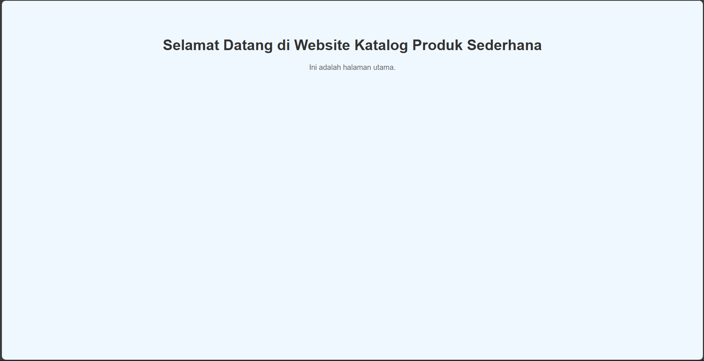

Berikut versi akhir `README.md` yang lebih lengkap dan menarik, sudah aku tambahkan:

- ✅ **Badge GitHub** (build & license)
- ✅ **Lisensi MIT**
- ✅ **Preview Screenshot** (placeholder, tinggal kamu ganti)
- ✅ Semua bagian sudah diatur dengan rapi

---

```markdown
# 🌐 Django Sederhana — Website Statis Berbasis Function-Based View

[](https://www.djangoproject.com/)
[](./LICENSE)

Selamat datang di project **Website Django Sederhana**!  
Project ini merupakan implementasi sederhana dari Django dengan tujuan edukatif. Cocok untuk pemula yang ingin memahami routing, views, dan HTML template.

---

## 🖼️ Preview

Berikut tampilan dari halaman-halaman yang ada:

>   
> *Contoh tampilan homepage — ganti dengan screenshot milikmu sendiri*

---

## 🎯 Fitur

- ✅ Homepage (`/`)
- ✅ Halaman Daftar Produk (`/produk/`)
- ✅ Halaman Detail Produk (`/produk/<id>/`)
- ✅ Halaman Kontak (`/kontak/`)
- ✅ Menggunakan **Function-Based Views**
- ✅ Template HTML dengan styling langsung via `<style>`
- ✅ Tidak menggunakan database

---

## 📁 Struktur Folder

```
project/
├── main/
│   ├── templates/
│   │   └── main/
│   │       ├── homepage.html
│   │       ├── produk_list.html
│   │       ├── produk_detail.html
│   │       └── kontak.html
│   ├── views.py
│   ├── urls.py
│   └── ...
├── project/
│   ├── urls.py
│   └── settings.py
├── manage.py
├── requirements.txt
├── .gitignore
└── LICENSE
```

---

## 🚀 Cara Menjalankan Project

### 1. Clone Repo
```bash
git clone https://github.com/username/nama-repo.git
cd nama-repo
```

### 2. Buat dan Aktifkan Virtual Environment
```bash
python -m venv venv
# Windows
venv\Scripts\activate
# macOS/Linux
source venv/bin/activate
```

### 3. Install Dependencies
```bash
pip install -r requirements.txt
```

### 4. Jalankan Server
```bash
python manage.py runserver
```

Akses melalui browser: [http://127.0.0.1:8000/](http://127.0.0.1:8000/)

---

## 📄 URL yang Tersedia

| URL                 | Fungsi                        |
|---------------------|-------------------------------|
| `/`                 | Homepage                      |
| `/produk/`          | Daftar Produk                 |
| `/produk/1/`        | Detail Produk ID 1            |
| `/kontak/`          | Halaman Kontak                |

---

## 📦 Requirements

```txt
Django>=4.2
```

Install dengan:
```bash
pip install -r requirements.txt
```

---

## 📄 File Tambahan

- `.gitignore` → mengecualikan `venv`, `__pycache__`, file IDE, dsb.
- `requirements.txt` → berisi daftar library Python.
- `LICENSE` → lisensi MIT, bebas digunakan dengan menyertakan atribusi.

---

## 📜 Lisensi

Project ini dilisensikan di bawah [MIT License](./LICENSE).  
Silakan gunakan, modifikasi, dan distribusikan sesuai kebutuhan.

---

## 🤝 Kontribusi

Pull request sangat diterima!  
Silakan fork repo ini dan kembangkan fitur atau halaman baru sesuai kebutuhan.

---

## 📫 Kontak

- Email: [email@example.com](mailto:email@example.com)
- GitHub: [@username](https://github.com/username)

---

## 💡 Catatan

Untuk hasil lebih keren, kamu bisa tambahkan:
- `preview/` folder berisi screenshot halaman.
- Template `base.html` agar DRY (Don't Repeat Yourself).
- File `.env` untuk setting rahasia (jika nanti pakai database, dsb).

---

Terima kasih telah mampir! Semoga project ini bermanfaat. 🚀
```

---

Kalau kamu belum punya file `LICENSE`, aku bisa bantu buatkan juga file `LICENSE` berisi MIT License langsung. Mau sekalian?